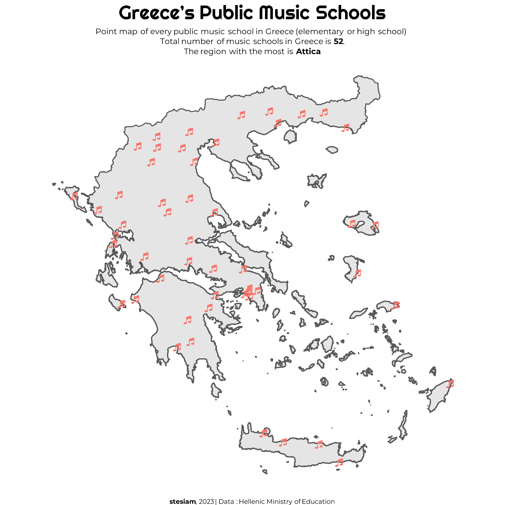
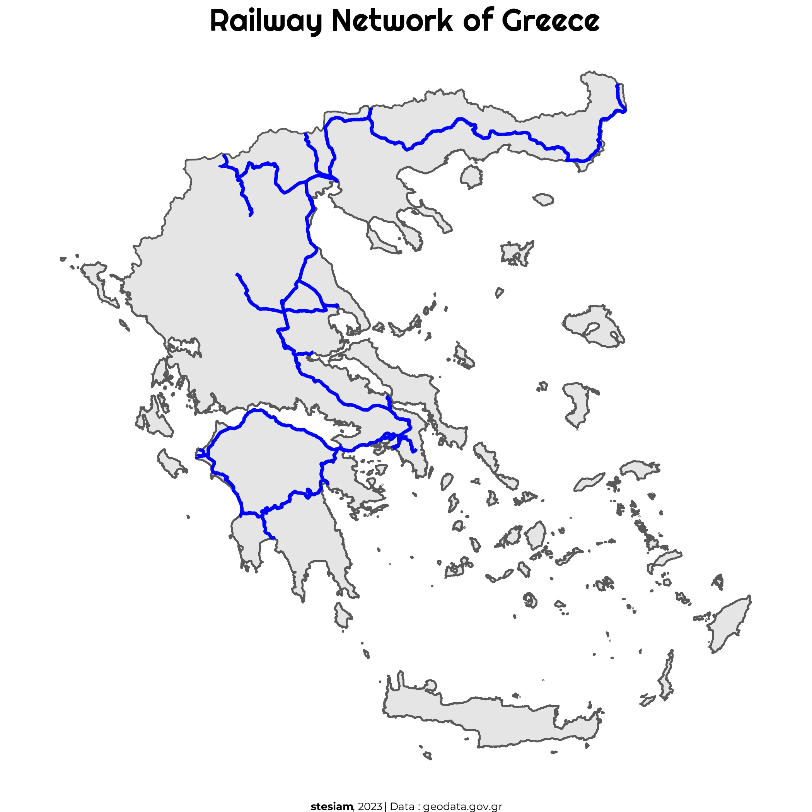
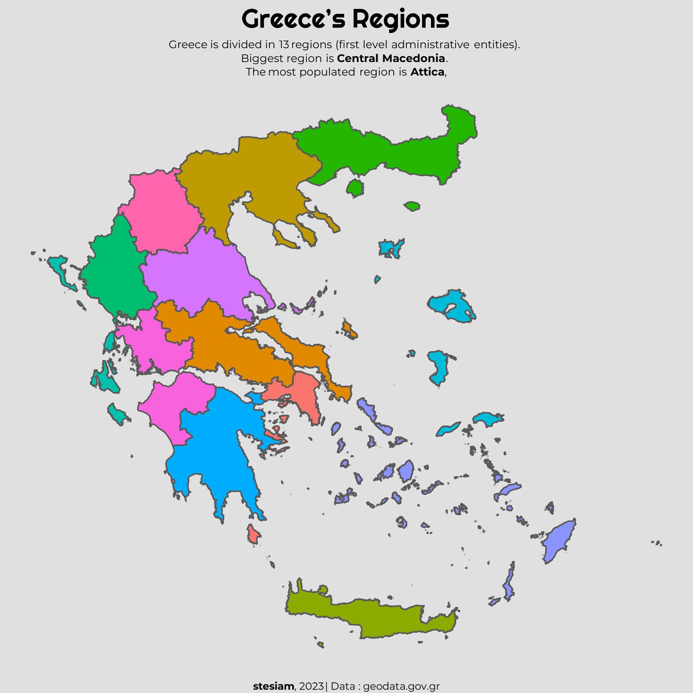
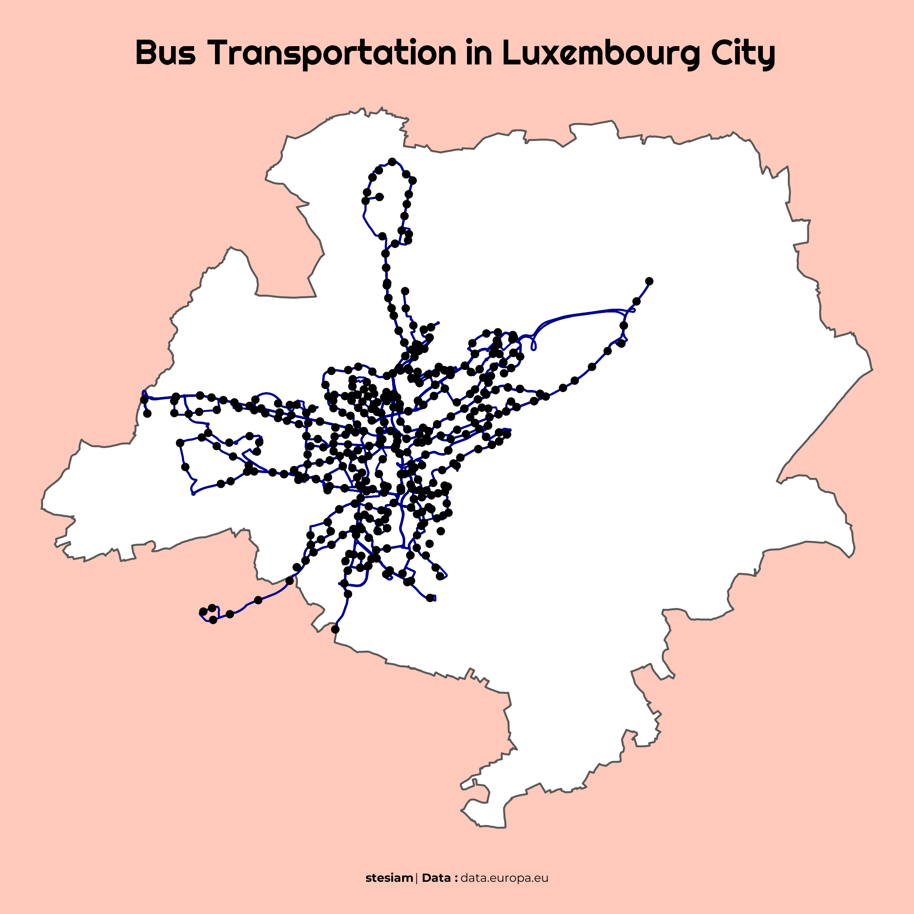
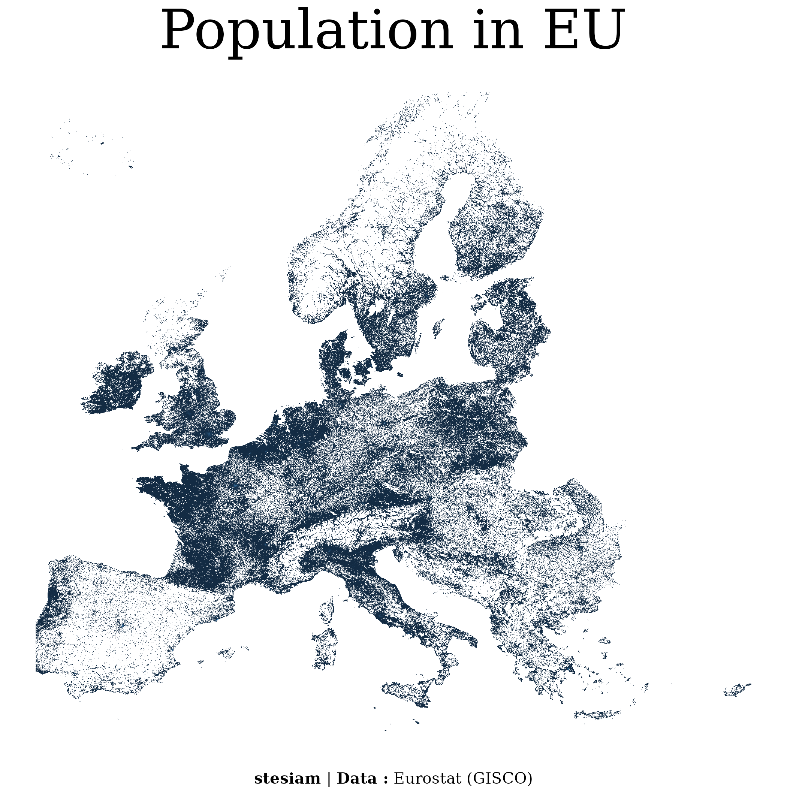
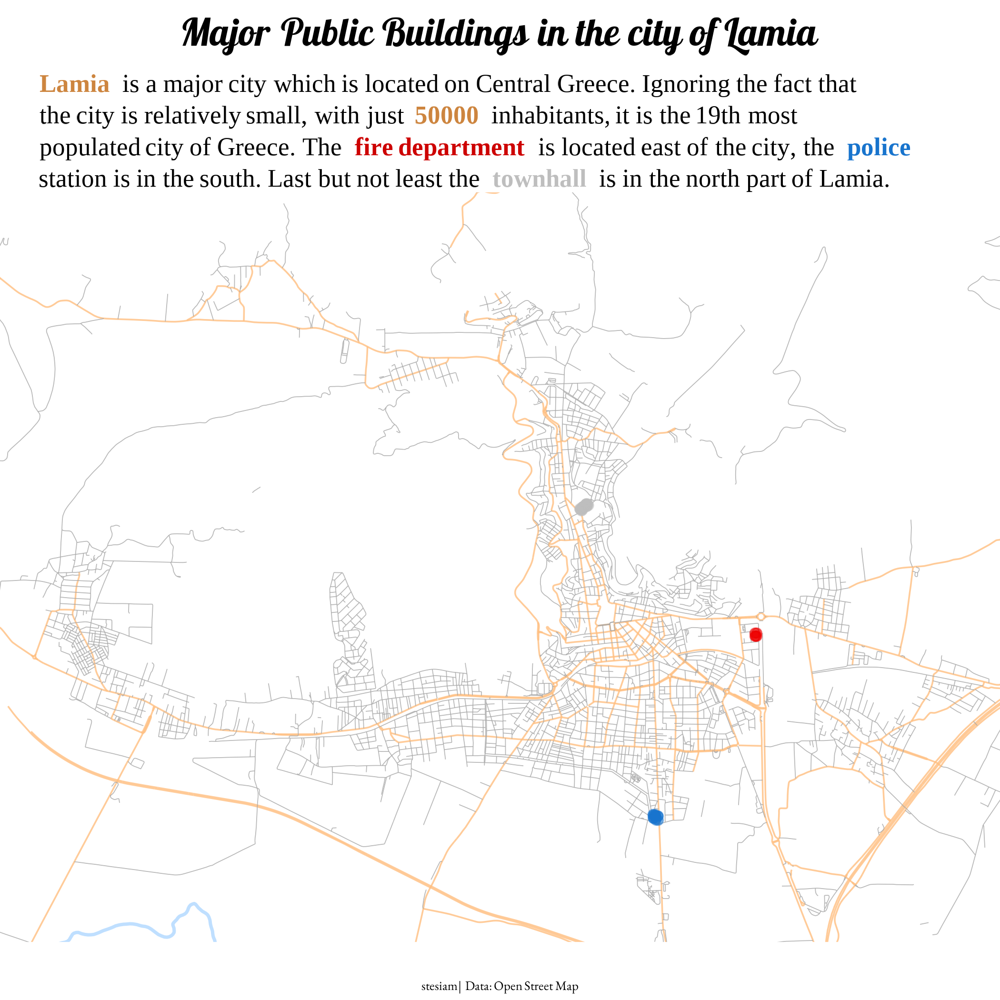
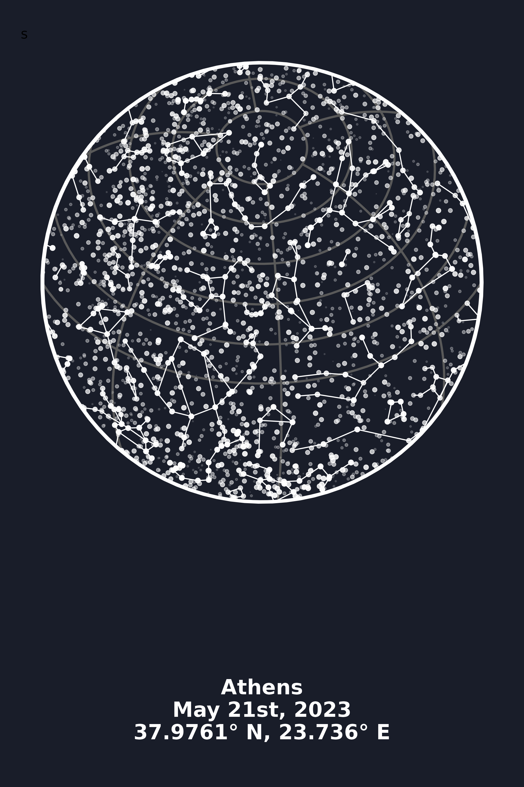
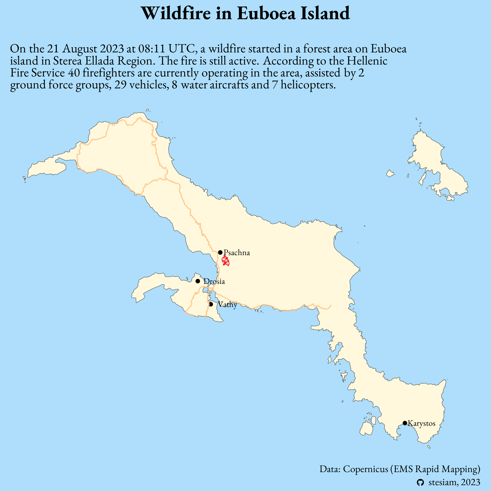

# 30 Day Map Challenge

## A short overview of my 30DMC - 2022

### **1. Music Schools**

**Date:** `Day 1`  
**Source:** Hellenic Ministry of Education  

### **2. Railroad Network**

**Date:** `Day 2`  
**Source:** geodata.gov.gr  

### **3. Regions**

**Date:** `Day 3`  
**Source:** geodata.gov.gr  

### **6. Luxembourg Bus Lines**

**Date:** `Day 6`  
**Source:** data.europa.eu  

### **7. Population of EU**

**Date:** `Day 7`  
**Source:** Eurostat (GISCO)  

### **8. Lamia, city**

**Date:** `Day 8`  
**Source:** Open Street Map  

### **9. Starmap**

**Date:** `Day 9`  
**Source:** geodata.gov.gr  

### **11. Wildfire**

**Date:** `Day 11`  
**Source:** Copernicus (EMS Rapid Mapping)  

---

