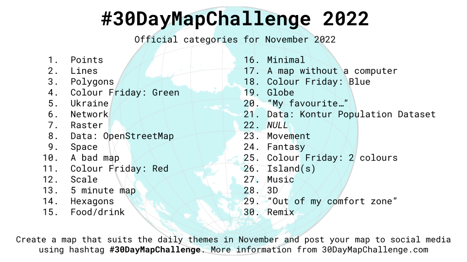

# 30 Day Map Challenge

## Overview


## My visualizations

### Day 1 


### Day 2 


-To edit - 


## Indicative calendar

| Day | Date       | Theme                           | Details                                                                                                                                                                                                                                                                                                                                         |   |
|-----|------------|---------------------------------|-------------------------------------------------------------------------------------------------------------------------------------------------------------------------------------------------------------------------------------------------------------------------------------------------------------------------------------------------|---|
|   1 | ```01-11-2022``` | Points                          | A map with points.                                                                                                                                                                                                                                                                                                                              |   |
|   2 | ```02-11-2022``` | Lines                           | A map with lines.                                                                                                                                                                                                                                                                                                                               |   |
|   3 | ```03-11-2022``` | Polygons                        | A map with polygons.                                                                                                                                                                                                                                                                                                                            |   |
|   4 | ```04-11-2022``` | Colour Friday: Green            | Map containing green colour.                                                                                                                                                                                                                                                                                                                    |   |
|   5 | ```05-11-2022``` | Ukraine                         | Map about Ukraine. Слава Україні!                                                                                                                                                                                                                                                                                                               |   |
|   6 | ```06-11-2022``` | Network                         | A subway network, information network, or something completely different.                                                                                                                                                                                                                                                                       |   |
|   7 | ```07-11-2022``` | Raster                          | A day dedicated to those lovely pixels.                                                                                                                                                                                                                                                                                                         |   |
|   8 | ```08-11-2022``` | Data: OpenStreetMap             | OpenStreetMap is **the** source for geospatial data. Use OSM to map something that is interesting to you. You can access the data e.g. from [GeoFabrik](https://www.geofabrik.de/data/download.html) or some of [these](https://learnosm.org/en/osm-data/getting-data/) sources. Remember to credit '© OpenStreetMap contributors'.             |   |
|   9 | ```09-11-2022``` | Space                           | Space as in a boundless three-dimensional extent or as in outer space. Or something else. You choose.                                                                                                                                                                                                                                           |   |
|  10 | ```10-11-2022``` | A bad map                       | Make intentionally a bad map. What makes a map bad?                                                                                                                                                                                                                                                                                             |   |
|  11 | ```11-11-2022``` | Colour Friday: Red              | Wohoo! Friday again! Make a red map!                                                                                                                                                                                                                                                                                                            |   |
|  12 | ```12-11-2022``` | Scale                           | In cartography scale is everything. How to make a map about scale? How to show the importance of scale?                                                                                                                                                                                                                                         |   |
|  13 | ```13-11-2022``` | 5 minute map                    | Some people spend hours on their maps. For day 13, set yourself a time limit of just 5 minutes and see what you can make.                                                                                                                                                                                                                       |   |
|  14 | ```14-11-2022``` | Hexagons                        | A map containing hexagons.                                                                                                                                                                                                                                                                                                                      |   |
|  15 | ```15-11-2022``` | Food/drink                      | Where does food come from? Where people consume most coffee? Or maybe you could make a map FROM food?                                                                                                                                                                                                                                           |   |
|  16 | ```16-11-2022``` | Minimal                         | How minimal can you go?                                                                                                                                                                                                                                                                                                                         |   |
|  17 | ```17-11-2022``` | A map without a computer        | Go outside. Pick up a pen. Do something that is not in a digital format.                                                                                                                                                                                                                                                                        |   |
|  18 | ```18-11-2022``` | Colour Friday: Blue             | Map containing blue colour.                                                                                                                                                                                                                                                                                                                     |   |
|  19 | ```19-11-2022``` | Globe                           | That round thing.                                                                                                                                                                                                                                                                                                                               |   |
|  20 | ```20-11-2022``` | _“My favourite…”_                 | Map something you like.                                                                                                                                                                                                                                                                                                                         |   |
|  21 | ```21-11-2022``` | Data: Kontur Population Dataset | Make a map with this population dataset. Data is in H3 hexagons with population counts at 400m resolution. Fixed up fusion of GHSL, Facebook, Microsoft Buildings, Copernicus Global Land Service Land Cover, and OpenStreetMap data. You can access it [here](https://data.humdata.org/dataset/kontur-population-dataset).                                                                                     |   |
|  22 | ```22-11-2022``` | NULL                            |  `   `                                                                                                                                                                                                                                                                                                                                          |   |
|  23 | ```23-11-2022``` | Movement                        | Make a map about something moving. Can be humans, animals or something else. Can be animated or static.                                                                                                                                                                                                                                         |   |
|  24 | ```24-11-2022``` | Fantasy                         | An imaginary place or a fantasy style.                                                                                                                                                                                                                                                                                                          |   |
|  25 | ```25-11-2022``` | Colour Friday: 2 colours        | Map containing only two colours.                                                                                                                                                                                                                                                                                                               |   |
|  26 | ```26-11-2022``` | Island(s)                       | Islands in the water, islands of innovation or something completely different.                                                                                                                                                                                                                                                                  |   |
|  27 | ```27-11-2022``` | Music                           | Music (or sound). How would you map it?                                                                                                                                                                                                                                                                                                         |   |
|  28 | ```28-11-2022``` | 3D                              | The magnificent third dimension! Visualize something in 3D                                                                                                                                                                                                                                                                                      |   |
|  29 | ```29-11-2022``` | _“Out of my comfort zone”_        | Challenge yourself. Maybe a map using a new tool?                                                                                                                                                                                                                                                                                               |   |
|  30 | ```30-11-2022``` | Remix                           | Take a map that you've done during the month and do a new version. Or take a map you really like by someone else and do your own version.                                                                                                                                                                                                       |   |

<!-- TABLE END -->
